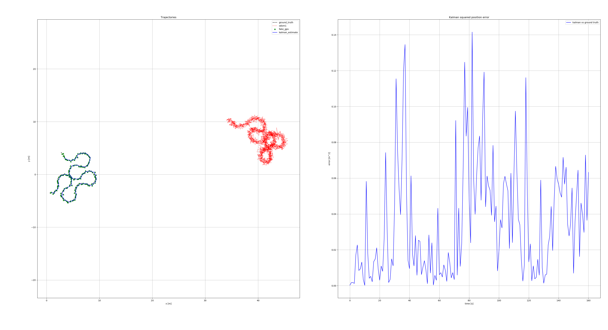
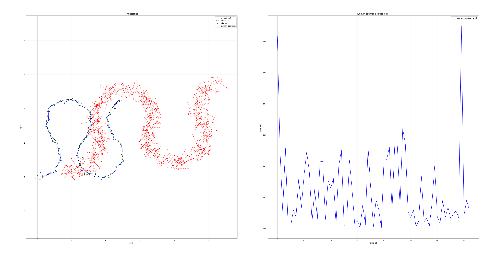
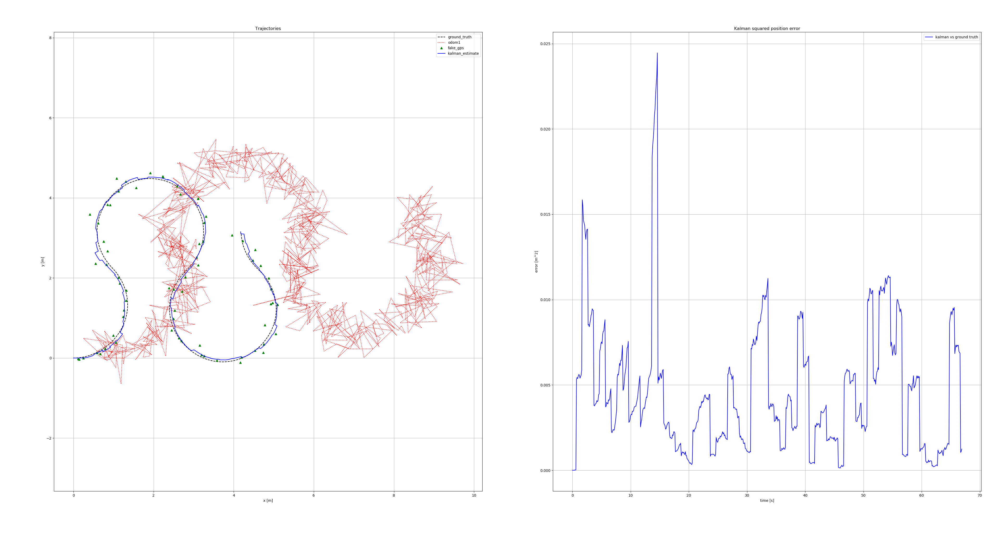
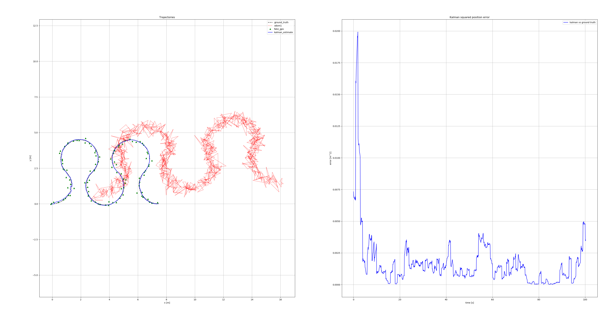

# Extended Kalman Filter Report

- the code has to major designs, second design occured in response to demonstration feedback

Based off the original kalman filter submission that used gps+odometry data to do kalman prediction filtering

To gain an understanding of the individual effects of each measurment, additionally, the filter was executed with varying combinations of the inputs.

## Method

Initially cloned from: `"git clone https://github.com/IgnacioCarlucho/B31YS_kalman_assignment_ROS1"`

The environment is called with: `"roslaunch rosbot_bringup fake_gps_random.launch"`

And the package containing the filter is ran with: `"roslaunch kalman_filter_assignment kalman_execution.launch student_name:=LukeEdgecombe"`

The behaviour is observed with: `"rosbag record -O kf_test /cmd_vel /fake_gps /odom1 /imu /kalman_estimate /odom"`

To make things easier to tune a seperate python file was added to introduce a series of configurable variables based on the noise assumptions

### Configuration

- IC - Initial noise state assumption

- IMU_YAW - Imu angle  in degree
- IMU_RATE - Imu rate in rad/s

- Q_DRIFT - xy drift in m/s (process noise for position)
- Q_YAW - angle deviation in degree/s (process noise for yaw)

- ODOM_XY - xy drift in cm
- ODOM_YAW - angle deviation in degrees

## Demonstration report

- Feedback from the report lead to a redesign on the code completely. The gps was used in places where it should not of been and there was no proper division between predicition and correction

---

## Extended Kalman Filter Redesign

Following demonstration feedback, the filter was completely redesigned to address fundamental architectural issues. Additionally after re-design, further issues were found.

### Key Issues Identified

1. **Incorrect prediction rate** - Original filter only ran prediction when GPS arrived (~1Hz), causing jagged output with large time steps
2. **Linear motion model** - Body-frame velocities were treated as world-frame, causing incorrect position integration
3. **Missing EKF Jacobian** - Covariance was not properly propagated for non-linear dynamics
4. **Improper process noise scaling** - Q matrix was constant instead of scaling with dt

### Architectural Changes

The redesigned EKF now follows proper architecture:

- **Prediction** runs at odometry rate (~10Hz) for smooth estimates
- **GPS correction** applied only when GPS measurement arrives (~1Hz)
- **Non-linear motion model** properly transforms body-frame velocities to world frame:

"x' = x + (vx×cos(yaw) - vy×sin(yaw)) × dt"
"y' = y + (vx×sin(yaw) + vy×cos(yaw)) × dt"
"yaw' = yaw + omega × dt"

- **Jacobian computation** for covariance propagation:

"F = [[1, 0, (-vx×sin(yaw) - vy×cos(yaw))×dt], [0, 1, (vx×cos(yaw) - vy×sin(yaw))×dt], [0, 0, 1]]"

- **Joseph form** covariance update for numerical stability
- **Process noise scaled by dt** for consistent behaviour across different time steps

### Tuning Process

The redesigned filter required re-tuning with different parameter interpretations:

| Measurement | VN1   | VN2   | VN3   | VN4   |
|-------------|-------|-------|-------|-------|
| IC          | 0.5   | 0.5   | 0.5   | 0.5   |
| Q_DRIFT     | 0.04  | 0.1   | 0.05  | 0.05  |
| Q_YAW       | 1.5   | 3.0   | 2.0   | 2.0   |
| R_GPS       | 0.03  | 0.15  | 0.25  | 0.25  |
| ODOM_XY     | 0.35  | 0.35  | 0.35  | 0.35  |
| ODOM_YAW    | 9.0   | 9.0   | 9.0   | 9.0   |

- vn4 had only code changes

### Tuning Observations

- **VN1**: Close to ground truth but jagged due to low R_GPS (trusting GPS too much)
- **VN2**: Smoother output but increased Q_DRIFT caused deviation from ground truth
- **VN3**: Reduced Q_DRIFT and increased R_GPS for better balance
- **VN4**: Final tuning with smooth output and good ground truth tracking

### Graphs of New EKF

<table>
<tr>
<td><strong>VN1</strong> </td>
<td><strong>VN2</strong> </td>
</tr>
<tr>
<td><strong>VN3</strong> </td>
<td><strong>VN4</strong> </td>
</tr>
</table>

### Final Configuration

"IC = 0.5, Q_DRIFT = 0.05 (m/s), Q_YAW = 2.0 (deg/s), R_GPS = 0.25 (m), ODOM_XY = 0.35, ODOM_YAW = 9.0"

## Results

The redesigned EKF provides smooth trajectory estimation at 10Hz, gradual GPS corrections without abrupt jumps, proper sensor fusion of odometry velocities and IMU yaw rate, and accurate ground truth tracking with reduced overall error.

## Further testing 

To demonstrate the influence of each sensor, the behaviour of the filter is recorded with varfying config (odometry only, odom+gps, gps+imu odom+gps+imu).

