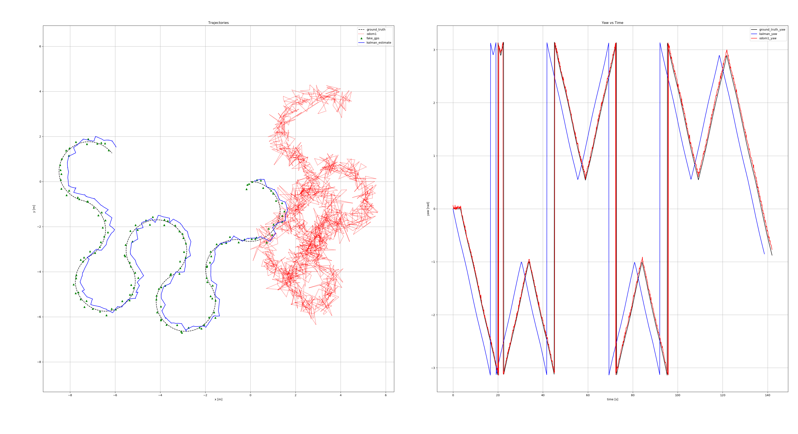
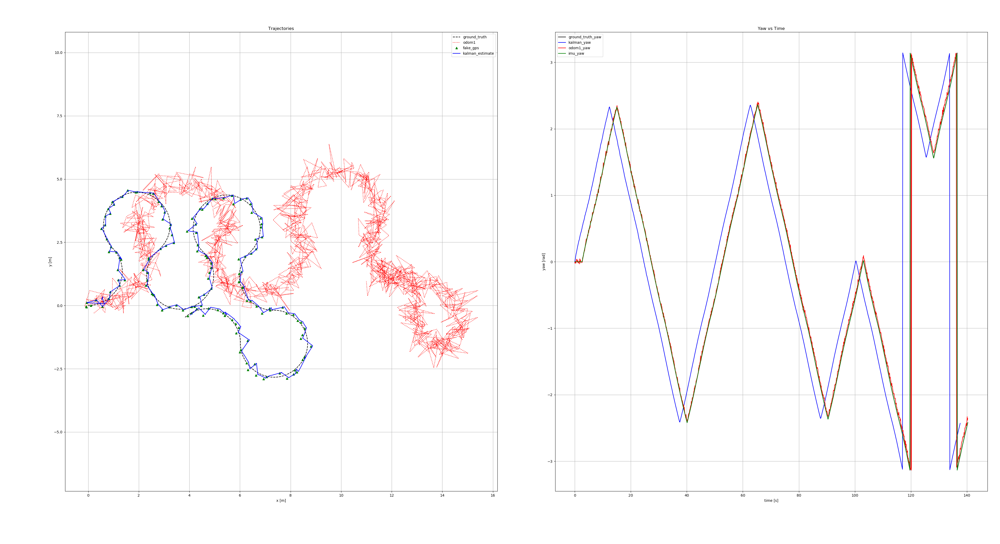

# Extended Kalman Filter Report

Based off the original kalman filter submission that used gps+odometry data to do kalman prediction filtering

To gain an understanding of the individual effects of each measurment, additionally, the filter was executed with varying combinations of the inputs.

## Method

Initially cloned from
```bash
git clone https://github.com/IgnacioCarlucho/B31YS_kalman_assignment_ROS1
```

The environment is called with 
```bash
roslaunch rosbot_bring fake_gps_random.launch
```

And the package containing the filter is ran with
```bash
roslaunch kalman_filter_assignment kalman_execution.launch student_name:=LukeEdgecombe
```

The behaviour is observed with 

```bash
rosbag record -O kf_test /cmd_vel /fake_gps /odom1 /imu /kalman_estimate /odom
```

To make things easier to tune a seperate python file was added to introduce a series of configurable variables based on the noise assumptions

### Configuration

- IC - Initial noise state assumption

- IMU_YAW - Imu angle  in degree
- IMU_RATE - Imu rate in rad/s

- Q_DRIFT - xy drift in cm
- Q_YAW - angle deviation in degree

- R_GPS - xy drift in cm

- ODOM_XY - xy drift in cm
- ODOM_YAW - angle deviation in degrees

### Initial state

IC = 0.5
IMU_YAW = 1.0
IMU_RATE = 0.02
Q_DRIFT = 0.05
Q_YAW = 2.0
R_GPS = 0.02
ODOM_XY = 0.20
ODOM_YAW = 5.0

## Method 

The config was verified visually by plotting the 2d motion of the robot along side the ground truth sensor.

- After initial graph, close to ground truth but jagged
- V2 lead to smoother prediction but with strong deviation from ground truth
- V3 was erratic
- V4 was a satisfactory result

### Table of changes

| Measurement | V1    | V2    | V3    | V4    |
|-------------|-------|-------|-------|-------|
| IC          | 0.5   | 0.5   | 0.5   | 0.5   |
| IMU_YAW     | 1.0   | 2.0   | 2.0   | 2.0   |
| IMU_RATE    | 0.02  | 0.02  | 0.02  | 0.02  |
| Q_DRIFT     | 0.05  | 0.02  | 0.04  | 0.04  |
| Q_YAW       | 2.0   | 1.0   | 1.5   | 1.5   |
| R_GPS       | 0.02  | 0.05  | 0.03  | 0.03  |
| ODOM_XY     | 0.20  | 0.30  | 0.30  | 0.35  |
| ODOM_YAW    | 5.0   | 8.0   | 8.0   | 9.0   |


### Graphs of changes

V1

V2

V3

V4
